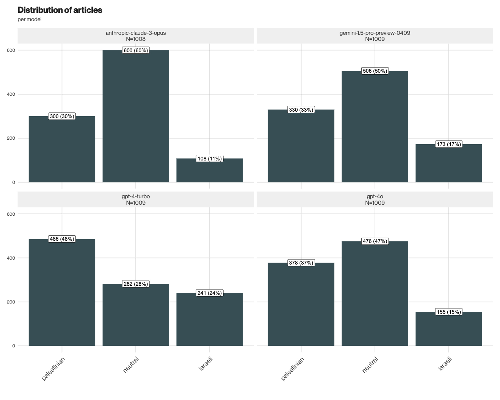

# Work in Progress: AI-Assisted Analysis of News Perspective

[Jari Bakken](mailto:jari@vg.no) &middot; June 7, 2024

We have used artificial intelligence to analyze 1,009 news stories about Israel and Gaza published between October 2023 and June 2024. This repository documents the method used.

## Files

- `prompt.txt` The prompt given to both journalists and models.
- `data/articles.jsonl` 60 news articles that were randomly selected for both human and AI classification.
- `data/classification.csv` Results of the classification by two journalists and four models.
- `data/ensemble.csv` The final classification based on the majority vote of the chosen model ensemble.
- `run.py` Code for running the LLM assessment (requires access to an internal VG API).
- `analyze.R` Analyze the results and generate the inter-rater agreement plot.

## Method

The task was to assess whether the main perspective in each story is _Israeli_, _Palestinian_, or _neutral_. The main perspective refers to which side is given more space and emphasis in the story.

The articles were analyzed by four large language models:

* OpenAI GPT-4 Turbo
* OpenAI GPT-4o
* Google Gemini 1.5 Pro
* Anthropic Claude 3 Opus

The models were [instructed](./prompt.txt) to consider language and tone, diversity of sources, factual accuracy, context and background. When the models disagreed, the perspective chosen by the majority was used.

Assessing perspective is challenging even for humans. There is a diversity of viewpoints on the conflict both within Israel and Gaza, and no perspective can truly be considered "neutral". By forcing the classifier to choose one of three categories, we simplify a complex reality. The results should therefore be interpreted with caution.

### Inter-rater agreement

To evaluate model performance, we randomly selected 60 articles for manual classification by two journalists, who were given the same instructions as the models. They agreed on the classification in 47 out of 60 articles, resulting in an inter-rater agreement of 78% and a [Cohen's kappa](https://en.wikipedia.org/wiki/Cohen%27s_kappa) of 0.64.

This inter-rater agreement was later used to determine the combination of LLMs that best matched the manual review, achieving an accuracy of 80-83% and a Cohen's kappa of 0.68-0.73.

## Example assessments

Here are examples of articles classified in each category, and an explanation for the classification from GPT-4 Omni.

| Article | Perspective  | Explanation  |
|---------|--------------|--------------|
| [Døde kropper i gatene](https://www.vg.no/i/2Bz38r) | Israeli | "The language and tone of the article are highly emotive and charged, using words like 'massacre', 'bloodthirsty', and 'terrorists' to describe Hamas and their actions. This language evokes strong emotions and clearly paints Hamas in a negative light. The article predominantly features Israeli sources and perspectives, including statements from the Israeli Prime Minister, an Israeli TV reporter, and the mayor of Sderot. There is a lack of Palestinian voices or perspectives in the article. The factual accuracy seems to be maintained, but the article heavily focuses on the Israeli casualties and the impact on Israeli civilians, with less emphasis on the Palestinian casualties and their context. The historical context is minimal, and the broader geopolitical factors are not deeply explored. The article focuses on the immediate events and the Israeli response, which can lead to a one-sided understanding of the conflict. The headline is sensationalized, using the phrase 'massacre on innocent civilians' which immediately sets a tone of victimization for one side." |
| [Israel og Hamas enige om avtale: Fire dagers våpenhvile og løslatelse av 50 gisler](https://www.vg.no/i/nQoOpx) | Neutral | "The article provides statements and perspectives from both Israeli and Palestinian sides, including official statements from both parties and mediators like Qatar. The language used is largely neutral and factual, without emotive or charged language that favors one side over the other. The article includes historical context and background information, such as the events of October 7 and the ongoing conflict. Multiple credible sources are cited, including Reuters, The Times of Israel, and AP, ensuring a balanced view. The headline is straightforward and not sensationalized." |
| [Frykter katastrofe: Israel kutter mat og vann til én million barn](https://www.vg.no/i/ab9OaM) | Palestinian | "The language and tone of the article are heavily emotive and sympathetic towards the Palestinian side, using phrases like 'frykter katastrofe' (fear catastrophe) and 'uskyldige offer' (innocent victims). The article includes graphic descriptions and images of Palestinian suffering, such as children being taken to the morgue and wounded children in ambulances. The sources cited, such as Jan Egeland from the Norwegian Refugee Council and a law professor, emphasize the negative impact of Israeli actions on Palestinian civilians and suggest that these actions could constitute war crimes. The article provides detailed accounts of the hardships faced by Palestinians due to the blockade, while the Israeli perspective is limited to a brief mention of the defense minister's statement and the justification of self-defense. The headline itself is sensationalized, focusing on the impact on children and using the word 'katastrofe' (catastrophe)." |

## Results

After analyzing all 1,009 articles, the chosen model ensemble classified 470 articles as _neutral_, 154 as _Israeli_ and 385 as _Palestinian_. The distribution of perspectives among the models is visualized below.

Anthropic Claude 3 Opus appeared to be the most conservative in its classification, with 60% of articles deemed neutral. In contrast, OpenAI GPT-4 Turbo was more inclined to assign a non-neutral perspective, classifying only 28% of articles as neutral—18 percentage points below the average.
